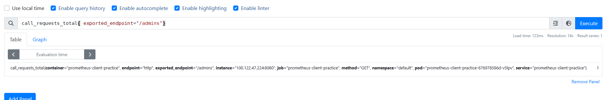
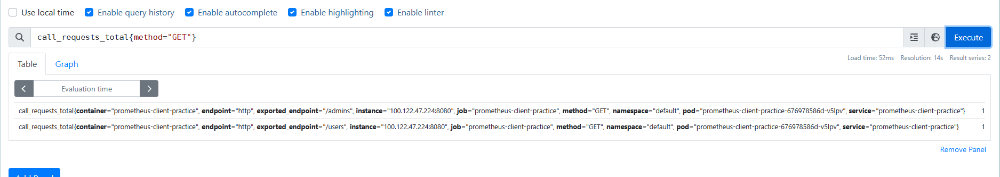
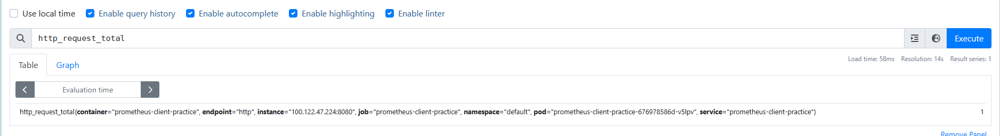

# PrometheusCustomIndicatorDemo


## 环境配置
- 带有prometheus的k8s集群

## 暴露的指标
- http_request_total
- call_requests_total


## 项目部署

```
kubectl apply -f deployment/promtest.yaml
```

## 添加监控记录
```
curl host_ip:svc_port/admins
curl host_ip:svc_port/users
curl host_ip:svc_port/
```
## 本地指标数据查询
```
curl host_ip:svc_port/metrics
```

## prometheus查询监控记录




